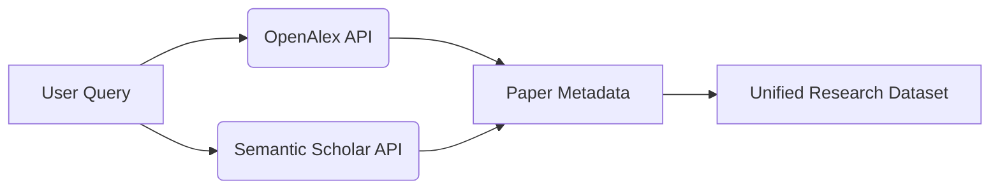

# 🧠 ResearcherAI — The Ethical AI Research Assistant

> Transform your research workflow with AI — summarize, explore, and identify gaps ethically and effortlessly.

---

## 🌍 Overview

**ResearcherAI** is an intelligent research assistant built for modern researchers.  
It connects with **OpenAlex** and **Semantic Scholar APIs** to retrieve and summarize academic content,  
uses **Pinecone** for semantic vector search, and **MongoDB** for user data and project management.

Unlike content generators, **ResearcherAI** is designed with ethics at its core —  
it *assists* researchers without generating plagiarized or unverifiable text.

---

## ✨ Key Features

✅ Smart literature search via OpenAlex + Semantic Scholar  
✅ AI summarization and research gap detection  
✅ Ethical writing mentor (non-plagiarizing assistant)  
✅ Semantic paper search powered by Pinecone  
✅ User authentication and personalized research memory (MongoDB)  
✅ Modular architecture — easily extendable for new features  

---

## 🧩 System Flow

### 1. User Layer
Users interact through a clean web dashboard built with **Next.js + TypeScript**.

- Sign in securely via MongoDB-based authentication  
- Create new research projects (topics or focus areas)  
- Explore AI-assisted literature summaries

---

### 2. Retrieval Layer (APIs)
When a user enters a topic:
- Query expanded via **Semantic Scholar**
- Papers fetched from **OpenAlex API**
- Combined, deduplicated, and filtered for open-access works




# Clone the repository
git clone https://github.com/MainakVerse/Researcher.git
cd Researcher

# Install dependencies
npm install

# Add your environment variables
cp .env.example .env

MONGO_URI=your_mongodb_uri
PINECONE_API_KEY=your_pinecone_key
OPENALEX_API=https://api.openalex.org
SEMANTIC_SCHOLAR_API=https://api.semanticscholar.org
OPENAI_API_KEY=your_openai_key
JWT_SECRET=your_jwt_secret

# Run the Development Server
npm run dev

```
researcher-ai/
│
├── components/
│   └── sections/
│       ├── Hero.tsx
│       ├── ProductDemo.tsx
│       ├── About.tsx
│       ├── Services.tsx
│       ├── JournalSlider.tsx
│       ├── FAQ.tsx
│       └── Footer.tsx
│
├── app/
│   ├── api/
│   ├── page.tsx
│   └── layout.tsx
│
├── lib/
│   ├── pinecone.ts
│   ├── mongo.ts
│   ├── ai.ts
│   └── utils.ts
│
├── public/
│   └── assets/
└── README.md
```
